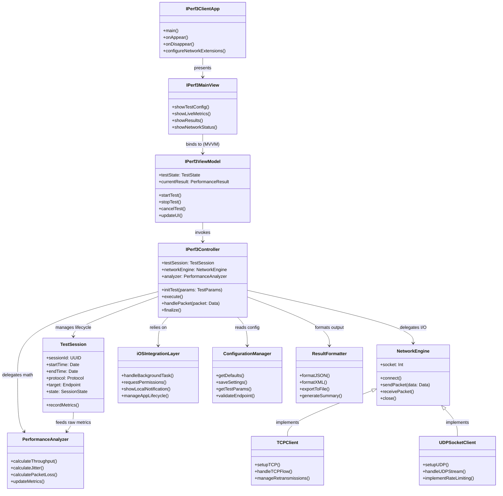

```mermaid
classDiagram
    %% ─────────────────────────────────────────────────────────────
    %% iOS UI & Presentation Layer
    %% ─────────────────────────────────────────────────────────────
    class IPerf3ClientApp {
        +main()
        +onAppear()
        +onDisappear()
        +configureNetworkExtensions()
    }

    class IPerf3MainView {
        +showTestConfig()
        +showLiveMetrics()
        +showResults()
        +showNetworkStatus()
    }

    class IPerf3ViewModel {
        +testState: TestState
        +currentResult: PerformanceResult
        +startTest()
        +stopTest()
        +cancelTest()
        +updateUI()
    }

    %% ─────────────────────────────────────────────────────────────
    %% Business Logic & Orchestration Layer
    %% ─────────────────────────────────────────────────────────────
    class IPerf3Controller {
        +testSession: TestSession
        +networkEngine: NetworkEngine
        +analyzer: PerformanceAnalyzer
        +initTest(params: TestParams)
        +execute()
        +handlePacket(packet: Data)
        +finalize()
    }

    class TestSession {
        +sessionId: UUID
        +startTime: Date
        +endTime: Date
        +protocol: Protocol
        +target: Endpoint
        +state: SessionState
        +recordMetrics()
    }

    class PerformanceAnalyzer {
        +calculateThroughput()
        +calculateJitter()
        +calculatePacketLoss()
        +updateMetrics()
    }

    %% ─────────────────────────────────────────────────────────────
    %% Network & Transport Layer
    %% ─────────────────────────────────────────────────────────────
    class NetworkEngine {
        +socket: Int
        +connect()
        +sendPacket(data: Data)
        +receivePacket()
        +close()
    }

    class TCPClient {
        +setupTCP()
        +handleTCPFlow()
        +manageRetransmissions()
    }

    class UDPSocketClient {
        +setupUDP()
        +handleUDPStream()
        +implementRateLimiting()
    }

    %% ─────────────────────────────────────────────────────────────
    %% iOS Integration & Data Layer
    %% ─────────────────────────────────────────────────────────────
    class iOSIntegrationLayer {
        +handleBackgroundTask()
        +requestPermissions()
        +showLocalNotification()
        +manageAppLifecycle()
    }

    class ConfigurationManager {
        +getDefaults()
        +saveSettings()
        +getTestParams()
        +validateEndpoint()
    }

    class ResultFormatter {
        +formatJSON()
        +formatXML()
        +exportToFile()
        +generateSummary()
    }

    %% ─────────────────────────────────────────────────────────────
    %% Relationships & Dependencies
    %% ─────────────────────────────────────────────────────────────
    IPerf3ClientApp --> IPerf3MainView : presents
    IPerf3MainView --> IPerf3ViewModel : binds to (MVVM)
    IPerf3ViewModel --> IPerf3Controller : invokes
    IPerf3Controller --> TestSession : manages lifecycle
    IPerf3Controller --> NetworkEngine : delegates I/O
    IPerf3Controller --> PerformanceAnalyzer : delegates math
    IPerf3Controller --> iOSIntegrationLayer : relies on
    IPerf3Controller --> ConfigurationManager : reads config
    IPerf3Controller --> ResultFormatter : formats output
    TestSession --> PerformanceAnalyzer : feeds raw metrics
    NetworkEngine <|-- TCPClient : implements
    NetworkEngine <|-- UDPSocketClient : implements
```